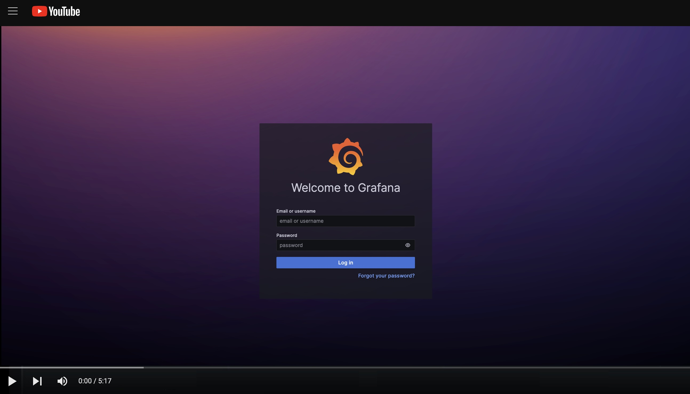

# Grafana and Prometheus Playground

This project wraps multiple prometheus services & grafana into a easy
to use `docker-compose` for rapid development.

* [Prometheus](https://prometheus.io/)
* [AlertManager](https://prometheus.io/docs/alerting/latest/alertmanager/)
* [Pushgateway](https://github.com/prometheus/pushgateway)
* [Grafana](https://grafana.com/oss/)
* [Ubuntu](https://ubuntu.com/) (built from `Dockerfile` to run **node-exporter**)


## Startup

A single `docker-compose up` will get you up and running. 

Data will be persisted within the untracked `/data` directory.
If you wish to wipe your data, merely delete this directory
and restart the your pods using docker-compose.

```
% docker-compose up
[+] Running 5/0
 ✔ Container grafana_prometheus_playground-ubuntu-1        Created                                                                     0.0s
 ✔ Container grafana_prometheus_playground-pushgateway-1   Created                                                                     0.0s
 ✔ Container grafana_prometheus_playground-prometheus-1    Created                                                                     0.0s
 ✔ Container grafana_prometheus_playground-grafana-1       Created                                                                     0.0s
 ✔ Container grafana_prometheus_playground-alertmanager-1  Created                                                                     0.0s
```

### Quick demo

[](https://www.youtube.com/watch?v=nWUobmGyb4w)

## Access

Each of the services have their own web interface
listening on a localhost.

### Prometheus UI

* http://localhost:9090

### AlertManager UI

The default configuration assumes an `.env` file exist with `SLACK_API_URL` set to your [Slack webhook](https://api.slack.com/start/quickstart):

```
% cat .env
SLACK_API_URL=https://hooks.slack.com/services/REDACTED/REDACTED/REDACTED
```

* http://localhost:9093

### Pushgateway UI

* http://localhost:9091

> Pushgateway is a metric store, it does not aggregate counts, merely stores a value for later scraping.

You can push a metric using curl: [documentation](https://github.com/prometheus/pushgateway?tab=readme-ov-file#command-line)

```
$ echo "my_number 1" | curl --data-binary @- http://localhost:9091/metrics/job/some_job
```

we are also able to use the api to fetch current metric data:

```
$ curl -s -X GET http://localhost:9091/api/v1/metrics | jq -r '.data[].my_number.metrics[].value'
```

Included is a small counter script: `scripts/counter.sh`
 
This script continuously increments the value of **my_number** by one,
this will eventually fire the alert we've configured in `config/prometheues_rules.yml`.

### Grafana UI

* http://localhost:3000

```
user: admin
password: admin
``````

Configure `http://prometheus:9090` as a Prometheus data source:

* http://localhost:3000/connections/datasources

Explore prometheus's metrics:

* http://localhost:3000/explore


### Python client

The prometheus based python client works as a scrape target:
https://prometheus.github.io/client_python/getting-started/three-step-demo/

I've installed the python `prometheus-client` package in our **ubuntu** container,
and setup this source as a scrape target in prometheus.

You can access the console to run the script:

```
$ docker-compose exec -it ubuntu bash
```

There is a script that creates it's own http service:

```
# python3 ../prometheus_client_example.py
```

Or one that pushes to our pushgateway instane:

```
# python3 ../prometheus_client_pushgateway_example.py
```

With this script running we can view the client stats directly:

* http://localhost:8000
