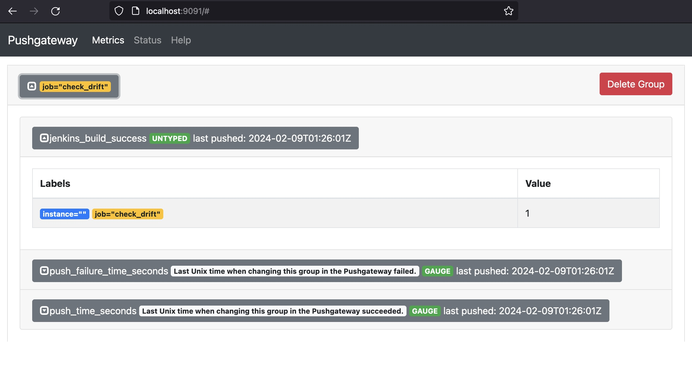

# Grafana and Prometheus Playground

Our `docker-compose.yaml` creates 4 containers:

* Prometheus
* [Pushgateway](https://github.com/prometheus/pushgateway)
* Grafana
* Ubuntu (built from Dockerfile to run `node-exporter`)

If you wish to explore the setup with SSL certificates
have a look at the `with-cert` branch.

## Startup

```
docker-compose up
```

## Access

### Prometheus UI

* http://localhost:9090


### Pushgateway UI

* http://localhost:9091

Pushgateway is a metric store, it does not aggregate counts, merely stores a value for later scraping.

You can push a metric using curl, [see documentation](https://github.com/prometheus/pushgateway?tab=readme-ov-file#command-line):

```
$ echo "jenkins_build_success 1" | curl --data-binary @- http://localhost:9091/metrics/job/check_drift
```

and fetch a metric:

```
$ curl -s -X GET http://localhost:9091/api/v1/metrics | jq -r '.data[].jenkins_build_success.metrics[].value'
```



### Grafana UI

* http://localhost:3000

> user: admin
> password: admin

Configure http://prometheus:9090 as a Prometheus data source:

* http://localhost:3000/connections/datasources

Explore prometheus's metrics:

* http://localhost:3000/explore


