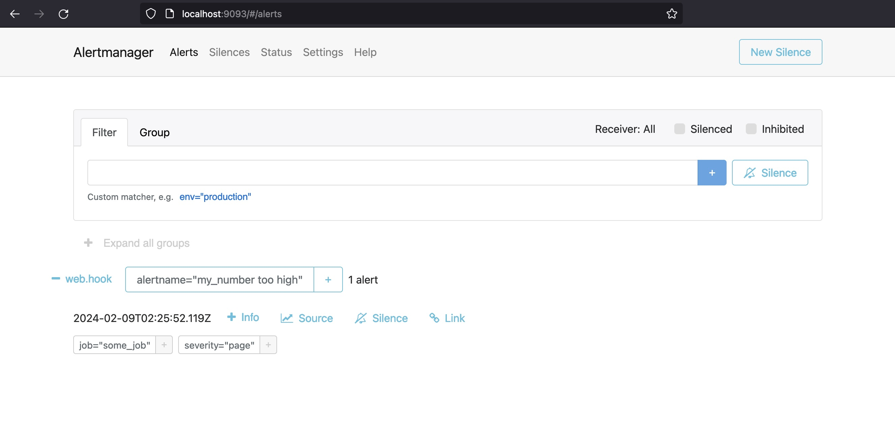

# Grafana and Prometheus Playground

Our `docker-compose.yaml` creates 5 containers:

* Prometheus
* AlertManager
* [Pushgateway](https://github.com/prometheus/pushgateway)
* Grafana
* Ubuntu (built from Dockerfile to run `node-exporter`)

If you wish to explore the setup with SSL certificates
have a look at the `with-cert` branch.

## Startup

```
docker-compose up
```

## Access

### Prometheus UI

* http://localhost:9090


### AlertManager UI

* http://localhost:9093



### Pushgateway UI

* http://localhost:9091

Pushgateway is a metric store, it does not aggregate counts, merely stores a value for later scraping.

You can push a metric using curl, [see documentation](https://github.com/prometheus/pushgateway?tab=readme-ov-file#command-line):

```
$ echo "my_number 1" | curl --data-binary @- http://localhost:9091/metrics/job/some_job
```

and fetch a metric:

```
$ curl -s -X GET http://localhost:9091/api/v1/metrics | jq -r '.data[].my_number.metrics[].value'
```

Included is a simple `counter.sh` script to continuously increment the value,
this will eventually fire the alert we've configured in `rules.yml`.


### Grafana UI

* http://localhost:3000

```
user: admin
password: admin
``````

Configure `http://prometheus:9090` as a Prometheus data source:

* http://localhost:3000/connections/datasources

Explore prometheus's metrics:

* http://localhost:3000/explore


