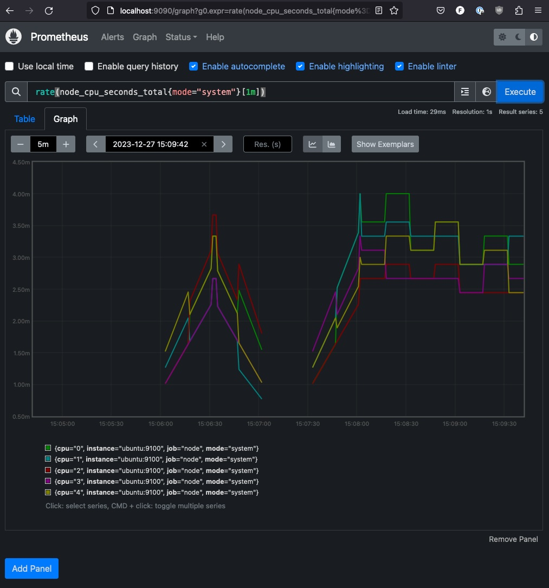
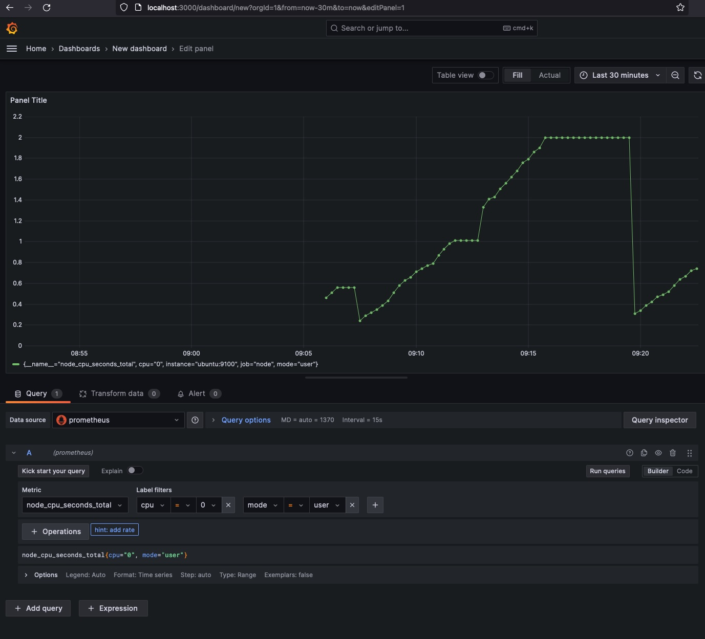

# Grafana and Prometheus Playground

Our `docker-compose.yaml` creates 3 containers:

* Prometheus (using our custom prometheus.yml and web-config.yml configs)
* Grafana
* Ubuntu (built from Dockerfile to run `node-exporter` using node-config.yml config)

## Create certs

Use the certs [readme](certs)

## Create password for node-exporter

Default username and password are user/password, but can be updated using
the htpasswd command and by modifying `prometheus.yml` and `node-config.yml`

```
htpasswd -nBC 10 "" | tr -d ':\n'; echo
```

## Startup

```
docker-compose up
```

## Access

From your local machine:

* http://localhost:9090  # prometheus ui




* http://localhost:3000  # grafana


